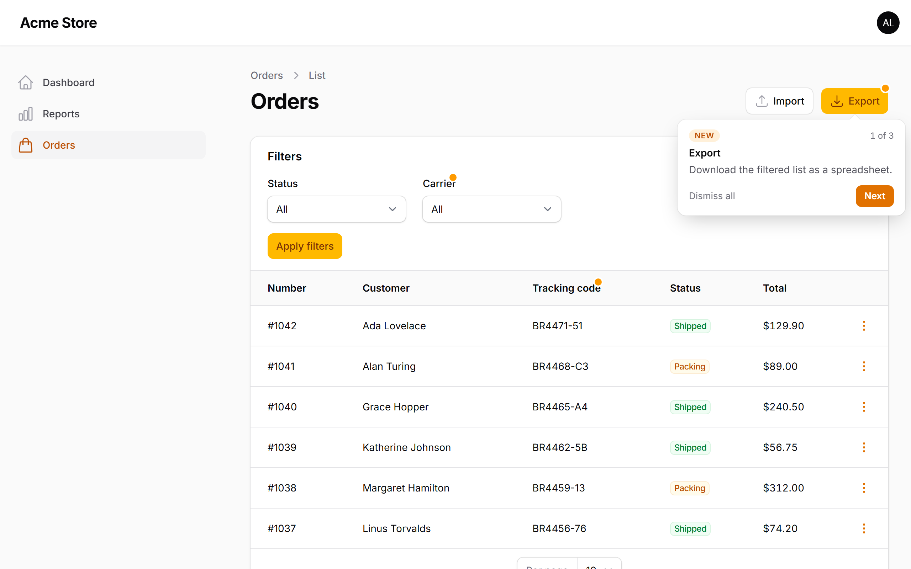
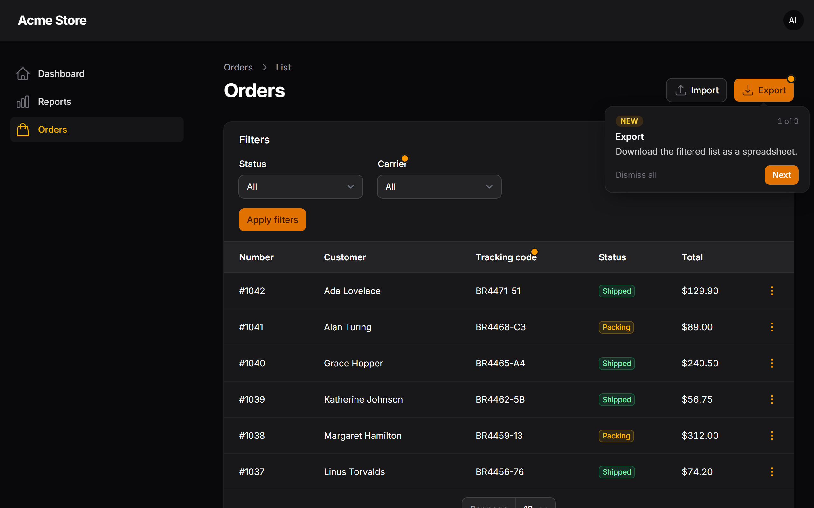
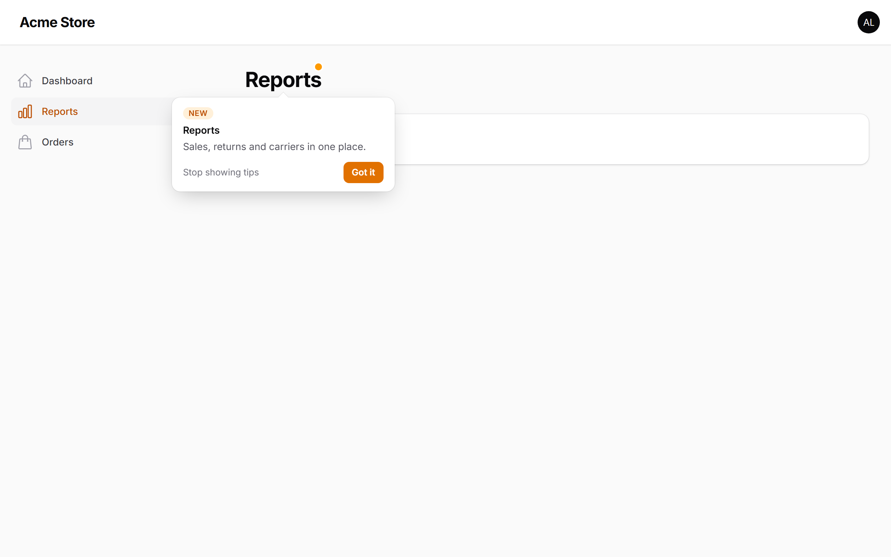

<p align="center">
    
</p>

<p align="center">
    <a href="https://packagist.org/packages/leonardo-max/new-here"></a>
    <a href="https://github.com/leonardo-max/new-here/actions/workflows/tests.yml"></a>
    <a href="https://github.com/leonardo-max/new-here/actions/workflows/phpstan.yml"></a>
    <a href="https://packagist.org/packages/leonardo-max/new-here"></a>
    <a href="LICENSE.md"></a>
</p>

# New Here

**Your changelog is not where your users are. Their screen is.**

New Here puts a pulsing beacon and a short hint **on the exact button, column, filter, field or page you just shipped** in your [Filament](https://filamentphp.com) panel. Each user sees it once — across browsers and devices — and then it gets out of the way.

```php
Action::make('export')
    ->isNew('2026-10-08', 'Download the filtered list as a spreadsheet.');
```

That's the whole API. No tour builder, no step definitions, no selectors.

| Light | Dark |
|---|---|
|  |  |

## Why

Teams ship every week — even more now that AI agents write half the code. Users don't read release notes. They open the screen they always open and miss the new button sitting right there.

New Here announces features **in context**:

- **Right where it lives.** The hint points at the new thing itself, not at a modal listing everything.
- **Once per person.** Dismissals are stored in the database, so a user who saw it on the laptop won't see it again on the phone.
- **Respects permissions.** If a user can't see the button, they don't get the hint — and it's not marked as seen behind their back.
- **No spam.** Up to 3 hints per page (configurable), queued in reading order. Announcements expire on their own after 30 days.
- **Newcomers aren't flooded.** Features released before a user signed up aren't announced to them: for them, everything is new.
- **Ship ahead.** A future `since` date schedules the announcement — merge today, it appears on release day.
- **AI-agent ready.** Ships a [Laravel Boost](https://laravel.com/docs/boost) guideline and skill so Claude Code, Cursor, Codex & co. mark what they build automatically.

## Requirements

- PHP 8.2+
- Laravel 11, 12 or 13
- Filament 5

## Installation

```bash
composer require leonardo-max/new-here
php artisan new-here:install
```

That's it. The plugin **registers itself on every panel** — there is no line to add to your panel provider. The install command:

1. creates the `new_here_seen` table (or just run `php artisan migrate`);
2. teaches your AI agents to announce what they ship (see [AI agents](#ai-agents)).

> [!NOTE]
> Assets are published by `php artisan filament:assets`, which Filament already runs on `composer update` through the `filament:upgrade` script. If you skipped that script, run it once.

## Usage

### Components

`->isNew(since, hint)` works on any Filament component:

```php
use Filament\Actions\Action;
use Filament\Actions\ActionGroup;
use Filament\Forms\Components\TextInput;
use Filament\Schemas\Components\Section;
use Filament\Schemas\Components\Tabs\Tab;
use Filament\Tables\Columns\TextColumn;
use Filament\Tables\Filters\SelectFilter;

// Header, row and bulk actions
Action::make('export')->isNew('2026-10-08', 'Download the filtered list as a spreadsheet.');

// Actions inside a group: the group trigger gets the beacon until it is opened
ActionGroup::make([
    Action::make('duplicate')->isNew('2026-10-08', 'Copy an order with one click.'),
]);

// Table columns and filters
TextColumn::make('tracking_code')->isNew('2026-10-08', 'See where each order is without opening it.');
SelectFilter::make('carrier')->isNew('2026-10-08', 'Filter orders by carrier.');

// Form fields, infolist entries, sections, tabs
TextInput::make('nickname')->isNew('2026-10-08', 'How the customer likes to be called.');
Section::make('Billing')->isNew('2026-10-08', 'All billing data in one place.');
Tab::make('Archived')->isNew('2026-10-08', 'Archived orders now have their own tab.');
```

### Pages, resources and clusters

Mark the whole class with the `#[IsNew]` attribute. The sidebar item gets a beacon, and the page heading gets the hint on the first visit:

```php
use LeonardoMax\NewHere\Attributes\IsNew;

#[IsNew('2026-10-08', 'Sales, returns and carriers in one place.')]
class Reports extends Page
{
    // ...
}
```



### Options

Both `->isNew()` and `#[IsNew]` accept named arguments:

| Argument | Default | What for |
|---|---|---|
| `since` | — | Release date. Nothing shows before it. |
| `hint` | — | One short sentence about the benefit, written for the end user. |
| `title` | the component label | Heading of the hint. |
| `key` | page class + type + name | Stable id. Change it to re-announce an element that changed (`key: 'export.v2'`). |
| `until` | `since` + 30 days | Custom end of the announcement. |

```php
Action::make('export')->isNew(
    since: '2026-10-08',
    hint: 'Now with charts.',
    title: 'Export, reimagined',
    key: 'export.v2',
    until: '2026-12-31',
);
```

Old markers are harmless: outside their window they render nothing. Clean them up whenever you touch the file:

```bash
php artisan new-here:list            # every marker: scheduled / active / expired
php artisan new-here:list --expired  # the ones you can delete
php artisan new-here:list --json     # for scripts and agents
```

## AI agents

If your project uses AI coding agents, the best time to announce a feature is the moment it is written. New Here makes that the default.

**With Laravel Boost**, nothing to do: New Here ships a [package guideline](resources/boost/guidelines/core.blade.php) and a [skill](resources/boost/skills/new-here/SKILL.md). `php artisan boost:install` / `boost:update` picks them up (the install command offers to run it).

**Without Boost**, `php artisan new-here:install` writes the same guideline into every agent file it finds — `AGENTS.md`, `CLAUDE.md`, `GEMINI.md`, `.github/copilot-instructions.md`, `.junie/guidelines.md` (creating `AGENTS.md` if none exists) — and copies the skill to `.claude/skills/` and `.agents/skills/`. The block sits between `<!-- new-here:start -->` markers, so running the command again updates it instead of duplicating it.

From then on, when you ask your agent for "a button to duplicate orders", it writes:

```php
Action::make('duplicate')
    ->isNew('2026-10-08', 'Copy an order with one click.');
```

## Configuration

Zero configuration is required. To customise a panel, add the plugin yourself — your instance replaces the automatic one:

```php
use LeonardoMax\NewHere\NewHerePlugin;

public function panel(Panel $panel): Panel
{
    return $panel
        // ...
        ->plugin(
            NewHerePlugin::make()
                ->expiresAfterDays(45)
                ->maxPerPage(2)
                ->openFirstHintAutomatically(false)   // only beacons until clicked
                ->ignoreFeaturesOlderThanUser(false)  // show the past to newcomers too
                ->enabled(fn(): bool => ! session()->has('impersonator')),
        );
}
```

Or publish the config file:

```bash
php artisan vendor:publish --tag=new-here-config
```

```php
return [
    'panels' => '*',                         // or ['admin'], or false to register by hand
    'expires_after_days' => 30,
    'max_per_page' => 3,
    'open_first_hint_automatically' => true,
    'ignore_features_older_than_user' => true,
    'user_created_at_attribute' => 'created_at',
    'table' => 'new_here_seen',
];
```

Translations ship in English, Brazilian Portuguese and Spanish. Publish them with `php artisan vendor:publish --tag=new-here-translations`.

### Replaying hints

```php
use LeonardoMax\NewHere\NewHere;

app(NewHere::class)->forget($user);  // the user will see every active hint again
```

## How it works

1. `->isNew()` adds `data-new-here-*` attributes to the component's HTML — only while the announcement is active, escaped, and merged with your own attributes.
2. A tiny Livewire component at the end of the panel body sends the browser the keys the user already dismissed.
3. A dependency-free Alpine component (~5 KB gzipped) finds the marked elements that are **actually visible**, draws the beacons in an overlay (no layout shift, no clipping), and follows them through modals, tabs, dropdowns and Livewire updates.
4. "Got it", "Next", "Dismiss all" — or simply using the element — stores the key for that user. Closing with <kbd>Esc</kbd> snoozes it until the next visit.

Accessible by default: beacons are buttons with labels, hints are dialogs, focus is managed only when the user opens a hint, and `prefers-reduced-motion` turns the animation off.

## Testing

Markers only render inside their window, so freeze time in your tests:

```php
use Illuminate\Support\Facades\Date;

Date::setTestNow('2026-10-08');

livewire(ListOrders::class)->assertSeeHtml('data-new-here=');
```

Run the package's own suite with:

```bash
composer test
composer analyse
```

## Roadmap

- Multi-step tours for features that span several screens.
- A "What's new" page that lists every active announcement with a *Show me* link.
- Adoption metrics: how many users saw, dismissed or used each feature.
- Audience rules (roles, tenants) on top of permissions.

Ideas and pull requests are welcome.

## Changelog

See [CHANGELOG](CHANGELOG.md).

## Contributing

See [CONTRIBUTING](.github/CONTRIBUTING.md).

## Security

Please review [our security policy](../../security/policy) on how to report security vulnerabilities.

## Credits

- [Leonardo Max](https://github.com/leonardo-max)
- [All contributors](../../contributors)

## License

The MIT License (MIT). See [LICENSE](LICENSE.md).
